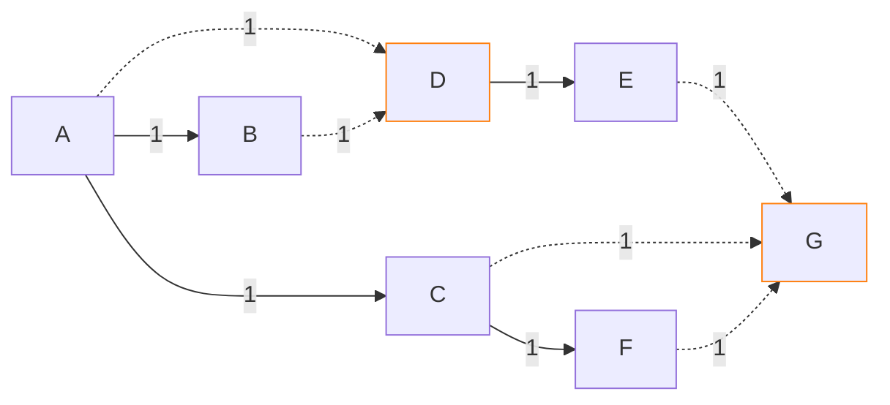

```mermaid
graph LR;
  A-->|1|B;
  A-->|1|C;
  A-.->|1|D:::recombinant;
  B-.->|1|D:::recombinant;
  D-->|1|E;
  E-.->|1|G:::recombinant;
  C-->|1|F;
  C-.->|1|G:::recombinant;
  F-.->|1|G:::recombinant;
classDef recombinant stroke:#ff7f0e;
```
