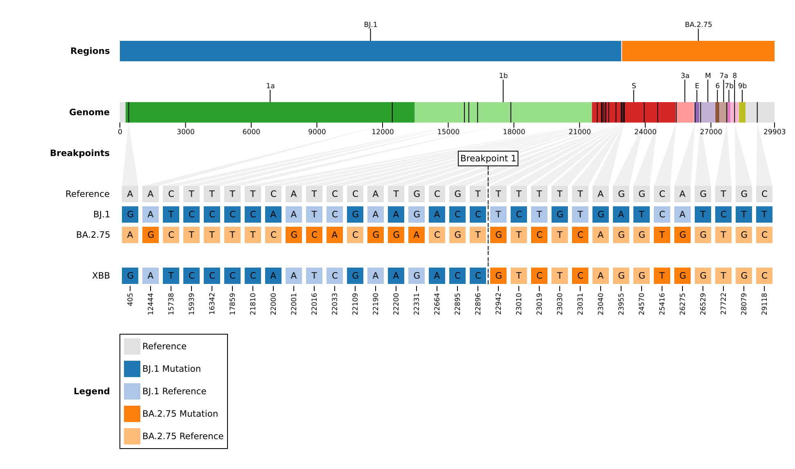

# Examples

Download a SARS-CoV-2 dataset, version controlled to the date 2023-11-30.

```bash
rebar dataset download \
  --name sars-cov-2 \
  --tag 2023-11-30 \
  --output-dir dataset/sars-cov-2/2023-11-30
```

## Populations

Use the names of dataset populations (ex. SARS-CoV-2 lineages) as input.

```bash
rebar run \
  --dataset-dir dataset/sars-cov-2/2023-11-30  \
  --populations "AY.4.2*,BA.5.2,XBC.1.6*,XBB.1.5.1,XBL" \
  --output-dir output/example/population

rebar plot --dataset-dir dataset/sars-cov-2/2023-11-30 --output-dir output/example/population
```

The populations (`--populations`) can include any sequence name found in the dataset's `populations.fasta`. For `sars-cov-2`, sequence names are the designated lineages. The wildcard character ("\*") will include the lineage and all its descendants. **NOTE**: If using "\*", make sure to use quotes (ex. `--lineages "XBC*,XBB.1.16*"`)!

## Alignment

Use an alignment of genomes as input.

```bash
wget https://raw.githubusercontent.com/phac-nml/rebar/main/data/example2.fasta

rebar run \
  --dataset-dir dataset/sars-cov-2/2023-11-30 \
  --alignment example2.fasta \
  --output-dir output/example/alignment

rebar plot --dataset-dir dataset/sars-cov-2/2023-11-30 --run-dir output/example/population
```

Please note that the `--alignment` should be aligned to the same reference as in the dataset `reference.fasta`! We strongly recommend [nextclade](https://clades.nextstrain.org/).

## Debug

To understand the inner-workings of the `rebar` algorithm, you can enable the debugging log with `--verbosity debug`. This is an INCREDIBLY verbose log on the dataset searches and hypothesis testing. We recommend only using this for a small number of input `parents`/`populations`.

```bash
rebar run \
    --dataset-dir dataset/sars-cov-2/2023-11-30  \
    --populations "XD" \
    --output-dir output/example/parents \
    --verbosity debug
```

## Parents

By default, `rebar` will consider all populations in the dataset as possible parents. If you would like to see the evidence for specific parents, you can restrict the parent search with `--parents`.

```bash
rebar run ...
rebar plot ...
```

## Knockout

Conversely to selecting specific parents, you can perform a 'knockout' experiment to remove populations from the dataset. For example, we might be interested in what the SARS-CoV-2 recombinant `XBB` would have been classified as _before_ it became a designated lineage.

```bash
rebar run \
    --dataset-dir dataset/sars-cov-2/2023-11-30  \
    --populations "XBB" \
    --knockout "XBB*" \
    --output-dir output/example/knockout

rebar plot --dataset-dir dataset/sars-cov-2/2023-11-30 --run-dir output/example/knockout  
```

The linelist (`output/example/knockout/linelist.tsv`) reveals that:

- `XBB` is descendant of `BJ.1` (`BA.2.10.1.1`), specifically a novel recombinant between `BJ.1` and `BA.2.75`.
- The `substitutions` column reveals:

  - 5 substitutions came from the `BA.2.75` parent: `T22942G`, `T23019C`, `T23031C`, `C25416T`, `A26275G`.
  - 1 substitution came from neither parent (private): `A19326G`

- This can be used to contribute evidence for a new lineage proposal in the [pango-designation](https://github.com/cov-lineages/pango-designation/issues) respository.

|strain        |validate|validate_details|population|recombinant|parents     |breakpoints|edge_case|unique_key                    |regions                             |substitutions                                                                                                                                                                                                                                                                                                                                                                                                                              |genome_length|dataset_name|dataset_tag|cli_version|
|:-------------|:-------|:---------------|:---------|:----------|:-----------|:----------|:--------|:-----------------------------|:-----------------------------------|:------------------------------------------------------------------------------------------------------------------------------------------------------------------------------------------------------------------------------------------------------------------------------------------------------------------------------------------------------------------------------------------------------------------------------------------|:------------|:-----------|:----------|:----------|
|population_XBB|        |                |BJ.1      |novel      |BJ.1,BA.2.75|22897-22941|false    |novel_BJ.1_BA.2.75_22897-22941|405-22896\|BJ.1,22942-29118\|BA.2.75|A405G,T670G,C2790T,C3037T,G4184A,C4321T,C9344T,A9424G,C9534T,C9866T,C10029T,C10198T,G10447A,C10449A,C12880T,C14408T,G15451A,C15714T,C15738T,T15939C,T16342C,C17410T,T17859C,A18163G,C19955T,A20055G,C21618T,T21810C,G21987A,C22000A,C22109G,T22200A,G22577C,G22578A,G22599C,C22664A,C22674T,T22679C,C22686T,A22688G,G22775A,A22786C,G22813T,T22882G,G22895C,T22896C\|BJ.1;T22942G,T23019C,T23031C,C25416T,A26275G\|BA.2.75;A19326G\|private|29903        |sars-cov-2  |2023-11-30 |0.2.0      |



## Validate

Run `rebar` on all populations in the dataset, and validate against the expected results.

```bash
rebar run \
    --dataset-dir dataset/sars-cov-2/2023-11-30 \
    --output-dir output/validate \
    --populations "*" \
    --threads 4
```
