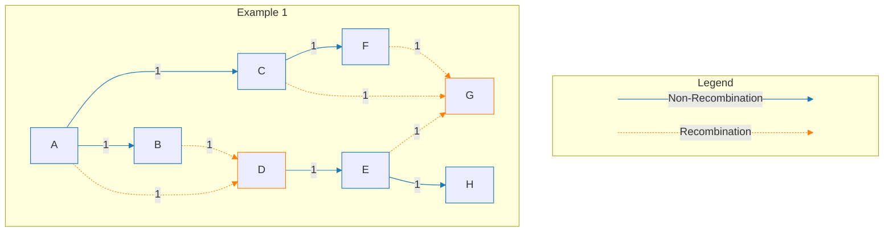

A library for phylogenetic methods and ancestral recombination graphs (ARG).

## Introduction

```mermaid
graph TD;

  subgraph Legend
    direction LR;
    D1[ ] --->|Non-Recombination| D2[ ];
    style D1 height:0px;
    style D2 height:0px;
    D3[ ] -..->|Recombination| R1[ ];
    style D3 height:0px;
    style R1 height:0px;
  end

  subgraph Example 1
    direction LR;
    0["A"]:::default-->|1|1["B"]:::default;
    0["A"]:::default-->|1|2["C"]:::default;
    0["A"]:::default-.->|1|3["D"]:::recombinant;
    1["B"]:::default-.->|1|3["D"]:::recombinant;
    3["D"]:::recombinant-->|1|6["E"]:::default;
    6["E"]:::default-.->|1|5["G"]:::recombinant;
    6["E"]:::default-->|1|7["H"]:::default;
    2["C"]:::default-->|1|4["F"]:::default;
    2["C"]:::default-.->|1|5["G"]:::recombinant;
    4["F"]:::default-.->|1|5["G"]:::recombinant;
  end

classDef default stroke:#1f77b4
classDef recombinant stroke:#ff7f0e

linkStyle 1,4,5,7,10,11 stroke:#ff7f0e
linkStyle 0,2,3,6,8,9 stroke:#1f77b4
```
