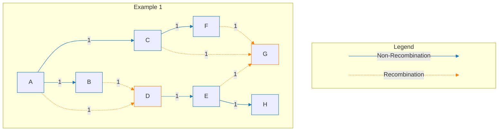

# rebarg

A library for ancestral recombination graphs (ARG).

# Introduction

- The nodes (`N`) can be a wide variety of types (ex. [`str`], [`String`], [`usize`](core::primitive::str), [`Node`], etc.).
- The branches (`B`) must be a type that can be cast into an [`f32`] for the length.
- See the [Implementation](#impl-Phylogeny<N,+B>) section for the allowed types based on traits.
- See the [`Node`] and [`Branch`] structs for examples of complex data types.

